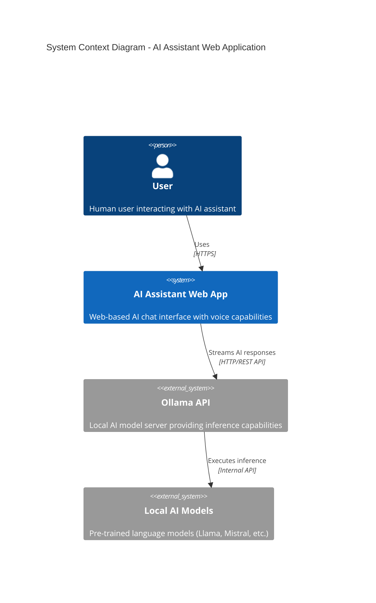

# 🤖 AI Assistant (Local) - Web Application

A modern, voice-enabled AI chat interface that runs entirely on your local machine using Ollama for AI model inference.

## 📋 Overview

This web application provides a chat interface with voice input/output capabilities, connecting to locally-hosted AI models through Ollama's REST API. The application features a responsive design, real-time streaming responses, and multiple AI personas.

## 🏗️ Architecture

### System Context
The application runs entirely locally on the user's machine with three main components:
- **Web Interface**: HTML/CSS/JavaScript application served by Nginx
- **AI Inference**: Ollama server providing model inference on localhost:11434
- **Voice Features**: Browser-based speech recognition and text-to-speech



### Technology Stack
- **Frontend**: HTML5, CSS3, ES6+ JavaScript
- **Voice**: Web Speech API (recognition & synthesis)
- **AI Integration**: Fetch API connecting to Ollama REST API
- **Markdown Rendering**: Marked.js library
- **Web Server**: Nginx for static file serving


## 🚀 Quick Start

### Prerequisites
- Modern web browser with Web Speech API support
- [Ollama](https://ollama.ai) installed and running
- At least one AI model downloaded (e.g., `ollama pull llama2`)

### Installation
1. Clone or download this repository
2. Configure your web server (Nginx/Apache) to serve the `aia/` directory
3. Ensure Ollama is running on `localhost:11434`
4. Open `index.html` in your web browser

### Usage
1. Select an AI persona from the dropdown
2. Click the microphone button to enable voice input
3. Type or speak your message
4. The AI will respond with streaming text and optional voice output

## 📁 Project Structure

```
aia/
├── index.html          # Main HTML structure
├── css/
│   └── style.css       # Application styling
├── scripts/
│   ├── config.js       # Configuration & prompts
│   ├── utils.js        # Utility functions
│   ├── speech.js       # Voice features
│   ├── chat.js         # Chat UI management
│   ├── api.js          # Ollama API client
│   └── main.js         # Application initialization
├── images/
│   └── icon.ico        # Application icon
└── README.md          # This file
```

## 🔧 Configuration

### Ollama Settings
- **Default URL**: `http://localhost:11434`
- **Model**: Configurable via `MODEL_NAME` in `config.js`
- **Streaming**: Enabled for real-time responses

### Voice Settings
- **Recognition**: Continuous speech-to-text
- **Synthesis**: Text-to-speech with voice selection
- **Languages**: Browser-dependent

## 🛡️ Security Considerations

### ⚠️ Important Security Notes

**Input Sanitization**: The application currently does not implement input sanitization. When deploying beyond localhost or accepting user-generated content, implement proper input validation and sanitization to prevent XSS attacks and other injection vulnerabilities.

**CORS Configuration**: If deploying the web application on a different domain/port than the Ollama server, configure appropriate CORS headers on the Ollama server to allow cross-origin requests from your web application domain.

**Local Deployment**: This application is designed for local use only. The current implementation assumes a trusted local environment. Additional security measures are required for any public deployment.

### Recommended Security Enhancements
- Implement Content Security Policy (CSP) headers
- Add input validation and sanitization
- Configure CORS properly for cross-origin deployments
- Consider authentication for multi-user scenarios
- Implement rate limiting for API requests

## 🎯 Features

- **Voice Input/Output**: Full speech recognition and synthesis
- **Real-time Streaming**: Live AI response streaming
- **Multiple Personas**: 10+ pre-configured AI personalities
- **Chat History**: Save/load conversation history
- **Responsive Design**: Mobile-friendly interface
- **Markdown Support**: Rich text formatting in responses
- **Local AI**: No external API dependencies

## 🔍 System Requirements

- **Browser**: Chrome 25+, Firefox 44+, Safari 14.1+, Edge 79+
- **RAM**: 4GB minimum (8GB recommended for larger models)
- **Storage**: 2GB+ for AI models
- **Network**: Local network access to Ollama server

## 🐛 Troubleshooting

### Common Issues
- **Voice not working**: Check browser permissions for microphone access
- **Ollama connection failed**: Ensure Ollama is running on port 11434
- **Model not found**: Run `ollama pull <model_name>` to download models
- **Slow responses**: Consider using smaller models or upgrading hardware

### Debug Mode
Enable browser developer tools (F12) to view console logs for debugging API connections and voice features.

## 🤝 Contributing

This is a local AI assistant project. Contributions are welcome for:
- Additional AI personas
- UI/UX improvements
- Performance optimizations
- Security enhancements
- Cross-platform compatibility

## 📄 License

This project is provided as-is for local AI experimentation. Please ensure compliance with Ollama's licensing terms and any applicable AI model licenses.

## ⚠️ Disclaimer

This application is for educational and personal use only. AI-generated content may not always be accurate or appropriate. Users should exercise discretion when using AI responses, especially for sensitive topics or decision-making.

---

*Built with modern web technologies for local AI interaction*